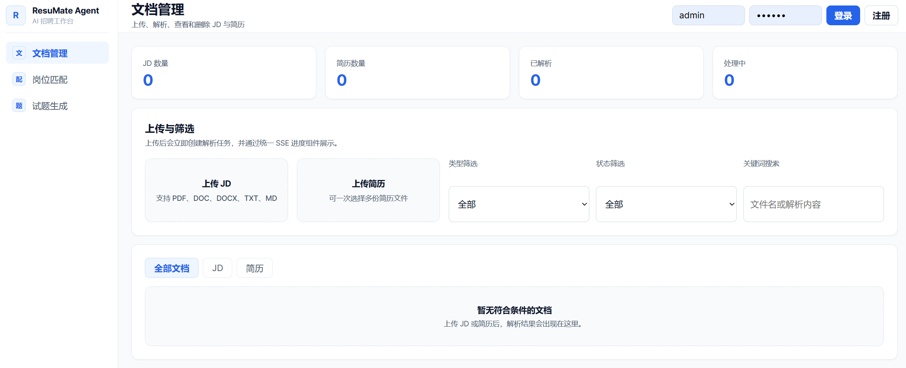
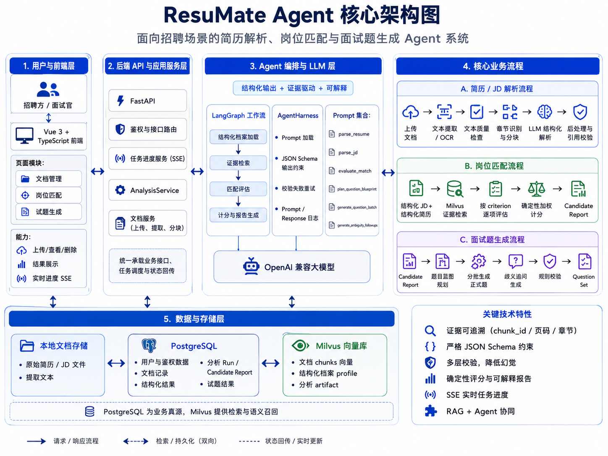

# ResuMate Agent

ResuMate Agent 是一个面向招聘场景的简历与岗位分析 Demo。项目使用 Vue 3 前端和 FastAPI 后端，支持上传简历/JD、抽取结构化信息、通过 Milvus 检索证据、计算候选人与岗位的匹配度，并生成面试问题。



## 功能概览

- 上传 PDF、Word、text、Markdown 格式的简历和岗位描述。
- 抽取结构化 JD 要求与 ResumeProfile，并保留来源引用。
- 使用 PostgreSQL 保存持久化业务状态，使用 Milvus 保存语义检索数据。
- 基于证据对候选人与岗位要求进行 criterion-level scoring。
- 根据匹配报告生成正式面试问题和 ambiguity follow-up。
- 通过 SSE 实时展示文档解析、匹配分析、问题生成进度。
- 对扫描版或低文本 PDF 支持 OCR fallback。

## 技术亮点

* **基于 LangGraph 的 Agent 工作流**
  
  将岗位匹配拆分为结构化档案加载、证据检索、能力评估、确定性计分和结果持久化等节点，实现状态驱动、职责清晰的分析流程。

* **统一的结构化 LLM Harness**
  
  集中管理 Prompt 加载、变量注入、模型调用、日志记录和异常处理；通过 Pydantic JSON Schema 约束模型输出，并在校验失败时自动反馈错误并重试。

* **证据驱动的简历解析与岗位匹配**
  
  所有关键简历字段均可追溯至原始页码、章节、文本片段和 `chunk_id`；岗位匹配只允许使用检索到的简历证据进行评分，减少模型主观推断和幻觉。

* **多层幻觉与格式校验机制**
  
  在 Prompt 约束之外，代码层进一步校验原文引用、页码、证据归属、岗位评价维度、权重、评分状态和面试题引用范围，避免模型伪造或越界使用证据。

* **确定性评分与可解释报告**
  
  LLM 负责逐项分析，最终匹配总分由 Python 根据岗位权重计算，保证结果稳定可复现；报告同时展示评分依据、优势、差距、风险和原始证据。

* **面向复杂简历的解析管线**
  
  支持 PDF、DOC、DOCX、TXT 和 Markdown，集成原生文本提取、OCR 识别、文本质量检测、章节识别、工作经历上下文恢复和语义分块。

* **RAG 与多存储协同架构**
  
  PostgreSQL 作为业务数据真源，保存文档、结构化结果、分析任务和报告；Milvus 保存文档向量、结构化档案和分析产物，用于岗位条件级证据检索。

* **分阶段面试题生成**
  
  采用“问题蓝图规划—分批生成—歧义追问—规则校验”的多阶段流程，覆盖简历经历、岗位核心能力、场景设计、能力缺口和行为评估，并绑定匹配证据。

* **SSE 实时任务进度**
  
  文档解析、岗位匹配和试题生成均提供实时进度事件，展示文件上传、文本提取、LLM 分析、Embedding、Milvus 入库和数据库保存等阶段。

* **完整的前后端业务闭环**
  
  基于 FastAPI、Vue 3、TypeScript 和 Pinia，实现文档上传与管理、解析结果查看、批量岗位匹配、证据报告展示、试题生成及历史记录管理。

* **可观测性与调试支持**
  
  对 LLM Prompt、响应、耗时、校验失败和运行异常进行分类记录，便于定位解析偏差、模型输出问题和端到端任务故障。

## 快速启动

### 1. 配置环境变量

复制环境变量模板，并填写自己的模型凭据：

```bash
cp .env.example .env
```

至少需要配置：

```env
OPENAI_API_KEY=
OPENAI_BASE_URL=
LLM_MODEL=
EMBEDDING_MODEL=
JWT_SECRET_KEY=
```

API Key 等敏感信息必须放在 `.env` 中管理。仓库会忽略 `.env`，只提交 `.env.example` 作为配置模板。

### 2. 使用 Docker 启动完整 Demo

```bash
docker compose up --build
```

Docker Compose 会启动：

- Frontend: `http://localhost:5173`
- Backend API docs: `http://localhost:8000/docs`
- PostgreSQL: `localhost:5432`
- Redis: `localhost:6379`
- Milvus: `localhost:19530`
- Attu Milvus UI: `http://localhost:8080`

### 3. Demo 操作流程

1. 打开 `http://localhost:5173`。
2. 注册或登录账号。
3. 上传一个 JD 和一份或多份简历。
4. 等待文档解析任务完成。
5. 发起匹配分析。
6. 打开候选人报告并生成面试问题。

## 本地开发

### 环境要求

- Python 3.11+
- `uv`，或 Python `venv` + pip
- Node.js 20+
- 如需完整运行工作流，本地需要 PostgreSQL、Redis、Milvus

### Backend

安装依赖：

```bash
uv sync
```

或使用虚拟环境：

```powershell
python -m venv .venv
.\.venv\Scripts\Activate.ps1
pip install -e .
```

启动 API：

```bash
uv run uvicorn backend.app:app --host 127.0.0.1 --port 8000 --reload
```

Backend 地址：

- API base: `http://127.0.0.1:8000`
- API docs: `http://127.0.0.1:8000/docs`

### Frontend

```bash
cd frontend
npm install
npm run dev
```

Vite dev server 默认运行在 `http://localhost:5173`，并将 `/api` 和 `/auth` 请求代理到 `http://127.0.0.1:8000`。

## 核心架构



### 模块划分

```text
frontend/
  Vue 3 + Pinia UI，负责 auth、documents、matching、reports、questions 页面

backend/routes/
  FastAPI route layer，负责 auth、document APIs、analysis runs、chat、SSE tasks

backend/services/
  应用服务层，负责文档存储/解析、OCR、分析编排、进度事件、
  resume post-processing、LLM output validation

backend/graph/
  基于 LangGraph 的候选人匹配 workflow

backend/agents/
  OpenAI-compatible structured LLM harness，使用 JSON Schema validation

backend/rag/ and backend/vector/
  Milvus persistence、vector search、embedding helpers

backend/db/ and backend/repositories/
  SQLAlchemy models 和 repository methods，负责 PostgreSQL 持久化状态

backend/prompts/
  JD parsing、resume parsing、matching、question generation 的 Prompt templates
```

### 数据流向

```text
User
  |
  v
Vue 3 frontend
  |
  v
FastAPI routes
  |
  +--> DocumentService
  |      |
  |      +--> file validation + storage under data/documents
  |      +--> PDF/DOCX/TXT extraction and OCR fallback
  |      +--> structured LLM parsing with Pydantic schemas
  |      +--> PostgreSQL document/profile records
  |      +--> Milvus document chunks and profile artifacts
  |
  +--> AnalysisService
         |
         +--> CandidateAnalysisGraph
         |      |
         |      +--> load structured JD/resume profiles from Milvus
         |      +--> retrieve criterion evidence from resume vectors
         |      +--> ask LLM for criterion-level match evaluation
         |      +--> calculate deterministic weighted score in Python
         |      +--> persist report to PostgreSQL and Milvus
         |
         +--> question blueprint + batched question generation
         +--> validation and PostgreSQL persistence
```

### 存储设计

PostgreSQL 是业务状态的 source of truth。它保存用户、上传文件元数据与路径、抽取文本、结构化 profile、分析 run、候选人报告、生成问题、状态、时间戳和 ownership。

Milvus 只保存语义检索数据。它保存向量化 chunks、document profile artifacts、candidate report artifacts，以及 user ID、document ID、run ID、candidate ID、artifact type 等过滤 metadata。Milvus 用于 evidence retrieval 和 semantic search，不作为最终报告、问题或权限状态的权威存储。

Redis 用于 cache 和 progress 相关的运行时支持。后端通过 progress service 发布 SSE task events，前端据此展示长任务进度。

## 核心工作流设计

### 文档解析

1. 写入文件前校验 filename、extension 和 size。
2. 将上传文件保存到 `data/documents`，并处理重名冲突。
3. 按文件类型抽取文本：
   - PDF: 先使用 native text，对视觉内容多或文本过少的页面执行 OCR fallback。
   - DOCX: 读取 paragraphs 和 tables。
   - DOC: 使用 `unstructured` legacy parser。
   - TXT/MD: 支持 UTF-8 和 GB18030 decoding。
4. 对 OCR 文本做 normalize，并记录 ambiguities，避免静默修正不确定 token。
5. 按 section 和 work-experience context 对简历分块，让每个 vector chunk 都能独立支撑后续 evidence retrieval。
6. 通过 schema-constrained LLM calls 解析结构化 profile。

### 候选人匹配

匹配流程定义在 `backend/graph/candidate_workflow.py`：

```text
load_structured_profiles
  -> retrieve_evidence
  -> evaluate_match
  -> calculate_score
  -> persist_report
```

LLM 只负责 criterion-level evidence evaluation，不计算最终总分和推荐结论。最终分数由 Python 确定：

```python
total_score = sum(item.weight * item.score / 5 for item in evaluations)
```

这样可以保证总分和 recommendation 逻辑 deterministic，并且更容易测试。

### 问题生成

面试问题生成被拆成多个较小的 structured calls：

```text
plan_question_blueprint
  -> generate_question_batch for first half
  -> generate_question_batch for second half
  -> generate_ambiguity_followups
  -> validate_question_set
  -> save questions
```

拆分后可以降低长 JSON 输出失败的概率，也更容易保持 question IDs、evidence IDs、criteria、follow-up format 的稳定性。

## Prompt 设计

Prompt 文件位于 `backend/prompts/`。

### 设计原则

- Strict JSON only: system prompt 注入目标 Pydantic JSON Schema，要求只返回符合 schema 的 JSON，不返回 Markdown。
- Conservative extraction: 解析类 Prompt 禁止无依据推断，要求重要事实具备 traceable source references。
- Evidence boundary: 匹配类 Prompt 只能使用检索到的 evidence objects 支撑正向评分。
- Deterministic scoring: Prompt 明确禁止计算 final score/recommendation，由 Python 统一处理。
- Source integrity: Prompt 要求 chunk IDs 与 source quotes 精确对应输入内容。
- OCR uncertainty handling: 对可疑 OCR/template residue 记录 ambiguities，而不是静默归一化。
- Smaller generation units: 面试题先规划 blueprint，再分批生成，以提升输出稳定性。

### 关键 Prompt 文件

- `parse_jd.md`: 抽取 `JobProfile`，包括 criteria 和 weights。
- `parse_resume.md`: 抽取 `ResumeProfile`，包括 source references、skill evidence levels、metrics、warnings、ambiguities。
- `evaluate_match.md`: 对每个 JD criterion 评分，只能使用该 criterion 下提供的 evidence。
- `plan_question_blueprint.md`: 在正式写题前规划问题覆盖范围。
- `generate_question_batch.md`: 根据 blueprint item 逐条生成正式面试问题。
- `generate_ambiguity_followups.md`: 针对证据不确定或缺失的地方生成 follow-up prompts。

### 稳定性策略

- 所有 structured LLM calls 都通过 `AgentHarness.run_schema`。
- Harness 使用 `response_format={"type": "json_schema", ...}` 和 Pydantic validation。
- 如果 validation 失败，Harness 会带着 validation errors 重试一次。
- 保存前的 validators 会检查 evidence IDs、criterion IDs、question counts 和 follow-up shapes。

## 难点与解决方案

### 1. 稳定生成 LLM JSON

难点：一次性要求模型输出完整报告或所有面试题时，容易出现 invalid JSON、字段缺失或 list shape 错误。

解决方案：所有 LLM 输出都通过 Pydantic JSON Schema 约束。问题生成拆成 blueprint、两个 question batches 和 follow-ups，最终合并结果在后端校验后再保存。

### 2. 保证匹配结果基于证据

难点：模型可能根据简历关键词或常识过度打分。

解决方案：匹配 Prompt 设置严格 evidence boundary：正向评分必须引用同一 criterion 下检索到的 chunk IDs。`hydrate_match_evaluation` 和 validation logic 会将 LLM 输出约束到允许的 evidence 范围内。

### 3. OCR 与简历文本质量

难点：扫描版简历和中英文混排 PDF 可能产生不完整、不可读或有歧义的文本。

解决方案：解析器优先使用 PDF native text，只对需要的页面执行 OCR。文本质量检查会拒绝不可读文档，同时把 OCR ambiguities 保存在 profile metadata 和 Prompt context 中。

### 4. 长流程状态持久化

难点：文档解析、匹配分析、问题生成都是长任务，需要支持页面刷新后继续查看结果。

解决方案：PostgreSQL 保存 runs、candidate reports、generated questions 和 statuses。Milvus 只保存检索 artifacts。前端从 PostgreSQL-backed APIs 重新加载持久状态，并通过 SSE 监听进行中的任务。
