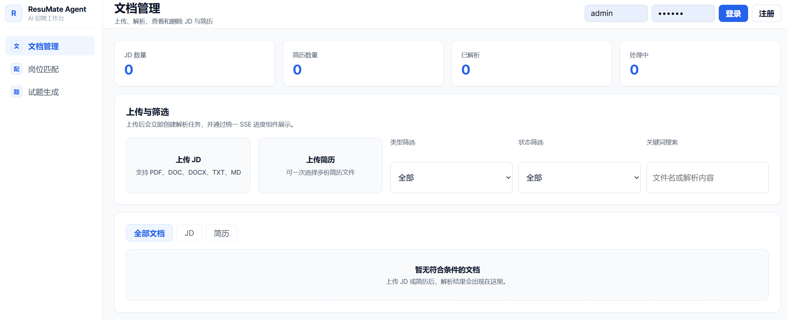

# ResuMate Agent

ResuMate Agent is a local recruiting workflow for parsing resumes and job descriptions, matching candidates against JD criteria, retrieving source evidence, and generating interview questions.

The lightweight macOS runtime uses one backend process with SQLite for business data and embedded Chroma for searchable document chunks. It does not require external service containers.



## Quick Start

```bash
uv sync --group dev
cp .env.example .env
uv run uvicorn backend.app:app --host 127.0.0.1 --port 8000 --reload
npm --prefix frontend ci
npm --prefix frontend run dev
```

Frontend: `http://localhost:5173`
Backend docs: `http://127.0.0.1:8000/docs`

Set `JWT_SECRET_KEY`, `OPENAI_API_KEY`, and `LLM_MODEL` in `.env` before using the app. Embeddings default to OpenAI-compatible remote embeddings with `text-embedding-3-small`.

## Optional Extras

Local embeddings:

```bash
uv sync --extra local-embeddings --group dev
```

Then set:

```env
EMBEDDING_PROVIDER=local
```

PDF OCR:

```bash
uv sync --extra ocr --group dev
```

Then set:

```env
PDF_OCR_ENABLED=true
```

## Architecture

```text
Vue 3 frontend
  -> FastAPI routes
     -> SQLAlchemy repositories
        -> SQLite data/resumate.db
     -> document extraction and chunking
        -> files under data/documents/
        -> embedded Chroma data/chroma/
     -> LangGraph candidate workflow
        -> load structured JD/resume profiles from SQLite
        -> retrieve resume evidence from Chroma
        -> evaluate criteria with structured LLM calls
        -> save reports and questions to SQLite
```

SQLite is the source of truth for users, uploaded document metadata, extracted text, structured profiles, analysis runs, candidate reports, and generated questions. Chroma stores only document chunks for evidence retrieval.

Persistent application data is created under:

- `data/resumate.db`
- `data/chroma/`
- `data/documents/`

## Supported Documents

Default upload formats:

- PDF
- DOCX
- TXT
- Markdown

Legacy `.doc` parsing is intentionally not part of the lightweight default runtime.

## Limits

This is a single-process local development runtime. The fixed-window rate limiter is process-local, so multiple backend processes do not share counters.

Changing `EMBEDDING_PROVIDER` or `EMBEDDING_MODEL` requires deleting `data/chroma/` and reparsing documents so stored vectors match the active embedding configuration.

## Verification

Backend:

```bash
uv run pytest backend/tests -q
```

Frontend:

```bash
npm --prefix frontend test
npm --prefix frontend run build
```
